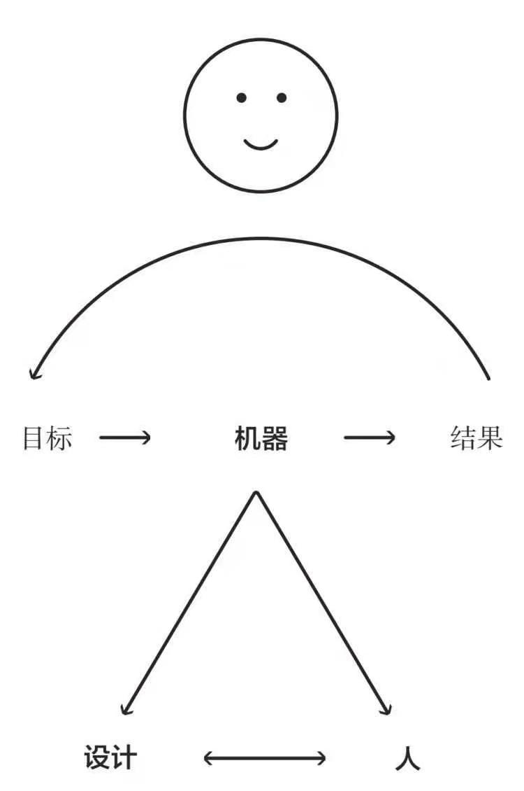
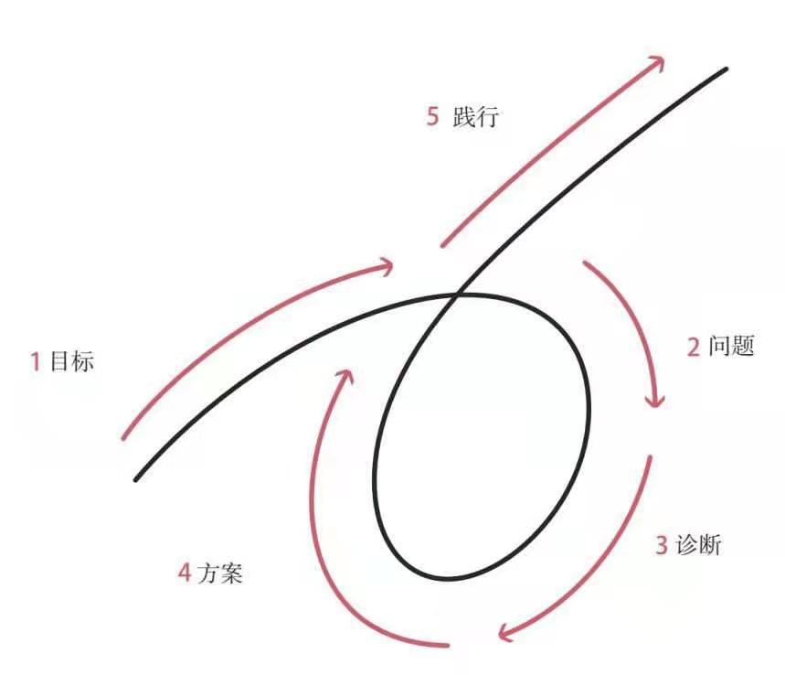

痛苦加反思等于进步
内控点，接受结果，心灵刻度尺
大多数人犯下的最大错误是不客观看待自己以及他人，这导致他们一次次的栽在自己或他人的弱点上
不要为自身形象担心，只需关心能不能实现你的目标
不要把不好的结果归咎于别人从自己身上找原因
根据直接结果，后续结果和在后续结果做决策
有明确的目标，找到阻碍你实现这些目标的问题，并且不容忍问题，准确诊断问题，找到问题的根源，规划可以解决问题的方案，做一些必要的事来践行这些方案，实现成果

