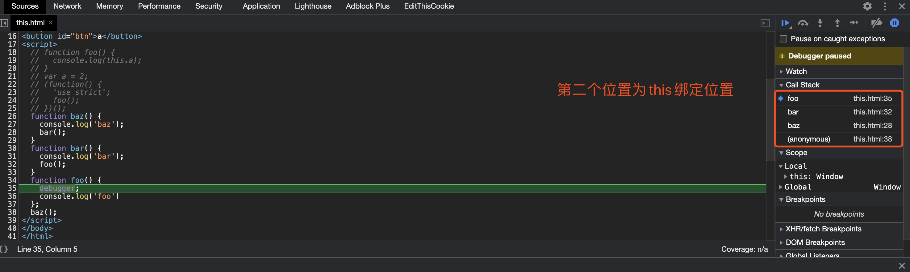

# 三言两语讲清楚一个概念

### 作用域
- 语言中存储和查找变量的规则
- 词法作用域与动态作用域
  - 词法作用域关注函数在何处声明，动态作用域关注函数在何处调用
  - 词法作用域是定义在词法阶段的作用域，是由你在写代码时将变量和块的作用域写在哪里来决定的
  - 动态作用域是在运行时确定的，作用域链是基于调用栈的，而不是代码中的词法作用域嵌套
- JS（ES6之前）中只存在全局作用域和函数作用域
- 引擎在作用域中查找变量的机制可以称之为在作用域链上查

### 闭包
- 闭包实际上是一种引用，是在非词法作用域期间调用的函数对词法作用域定义的上下文的引用
- 当函数可以记住并访问所在的词法作用域，即使函数是在当前词法作用域之外执行，这时就产生了闭包
- 闭包就是一个返回值为函数的函数

### this
- 关于this 的两大误解
  - this 指向函数自身
  - this 指向函数的词法作用域
- this 的绑定和函数声明的位置没有任何关系，只取决于函数的调用方式
- 绑定规则，优先级 this > 显式 > 隐式 > 默认
  - 默认绑定
  - 隐式绑定 `obj.foo()`
  - 显式绑定：call apply
    - 硬绑定，由于硬绑定是一种非常常用的模式，所以ES5 提供了Function.prototype.bind 方法
    ```js
    var bar = function() {
      foo.call(obj)
    }
    setTimeout(bar, 100);
    ```
- 查看callStack

- 用null 来进行显显式绑定（柯里化或展开数组），可能会存在意想不到的问题。因此可以创建DMZ-一个空的非委托对象来替代null
```js
function foo(a, b) {
  console.log(a, b)
}
foo.apply(null, [2, 3])
var bar = foo.bind(null, 2);
bar(3);
```
```js
var ∅ = Object.creat(null);
// ∅和{}的区别
∅.__proto__ // undefined
{}.__proto__.__proto__ // null
```

### this 与new
- JS中实际上并不存在所谓的“构造函数”，只有对于函数的“构造调用”
- new 是最后一种可以影响函数调用时this的绑定行为方法，称之为new 绑定
- 在new 的过程中发生了以下几件事情
  - 创建一个全新的对象
  - 这个新对象会被执行[[prototype]]链接
  - 这个新对象会绑定到函数调用的this
  - 如果函数没有返回其他对象，那么new 表达式中的函数调用会自动返回这个新对象

### 关于依赖注入
- 便于测试，服务中使用Service，测试时使用MockService
- 可以适应不同的场景，比如说在整个应用中共享服务的单一实例，或者说每次用到该服务都创建一个实例

