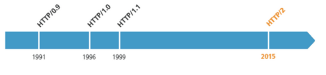

## 关于Http
### (1) Http 历史

### (2) Http 基本优化
- 影响Http 网络请求速度的因素：带宽和延迟
    - 延迟包含：
        - 浏览器阻塞，对于同一个域名，请求数有限制，超过最大请求数就会阻塞
        - DNS 查询，可以利用DNS 缓存优化
        - 建立连接，三次握手
### (3) Http 1.0 与Http 1.1
- 缓存处理：1.0 使用If-Modified-Since,Expires。1.1 引入更多的缓存策略如Entity tag，If-Unmodified-Since, If-Match, If-None-Match。
- 带宽优化及网络连接使用：1.1 允许请求资源的某个部分，返回码是206
- 错误通知处理：1.1 增加多个错误响应状态码
- Host 头处理：1.0 默认一台主机只有一个ip，但是1.1 不一样，需要写到host 头部信息
- 长连接：1.1 默认长连接，可以在一个tcp 连接上发送多个http 相应和请求
- 存在的问题
    - 多次建立连接，增大延迟
    - 明文传输，不安全
    - header 里携带的内容过大，且每次不怎么变化，浪费流量
    - 长连接使用多了会造成性能压力
### (4) Http 与Https
- 网景于1994 年创建Https
- Https = Http + SSL(TLS)
- Http 端口80，Https 端口443
- Https 是通过对明文信息进行加密保证信息的安全性，防止运营商劫持。涉及到加密就需要有密码，为了保证安全性需要使用非对称加密 + 对称加密的方式进行。涉及到非对称加密就要有公钥和私钥，涉及到公钥私钥就要有证书，因此Https 协议需要向CA 购买证书。
### (5) Https 与Http2
- Https 消耗大，只能解决安全问题，解决不了性能问题，而且加解密的过程实际上会造成性能问题。于是出现了Http2
- Http2 支持明文传输、使用新的二进制格式、压缩消息头、多路复用（连接共享，只有一个Tcp 连接，双工通信）、服务端推送
- 当丢包率大于2%的时候，HTTP2 的队头阻塞比HTTP1 更严重

## 关于Http Header
### (1) Http Header 分为以下四种：
- 通用Header
- Request Header
- Response Header
- 实体Header

### (2) 通用Header 包含哪些内容？
- 缓存管理：Cache Control
- 连接管理：Connection
- 日期：Date
- Pragma：Cache Control 向后兼容
- Transfer Encoding、Upgrade、Via、Warning

### (3) Request Header 包含哪些内容？
- 我是谁：User-Agent、Authorization、Proxy-authorization
- 我从哪里来：From、Referer
- 我要到哪里去：Host、Max-forwards
- 我想要什么：Accept、Charset、Encoding、Language、Expect、TE
- 我有什么要求：If-Match、If-none-match、If-modified-since、If-range、If-unmodified-since

### (4) Response header 包含哪些内容？
- 你是谁：WWW-anthenticate
- 我是谁：Server
- 你要的我有没有：Accept-ranges、Etag、
- 谁那里有：Location
- 现在暂时没有：Retry-after

### (5) 实体Header 包含哪些内容？
- Allow
- Content Encoding、Content Language、Content Type、Content Length、Content-location、Content-Range
- Expires、Last Modified

### (6) Cookie 相关
- Set Cookie
- Cookie

### (7) 其他Header
- X-Frame-Options、X-XSS-Protection、DNT、P3P

## Http状态码
### 单独说说204
- 什么情况下会出现204？跨域下的非简单请求，详情参考：https://stackoverflow.com/questions/29954037/why-is-an-options-request-sent-and-can-i-disable-it
- 如何优化204
    - 通过设置`Access-Control-Max-Age`头对204结果进行缓存。但是不同浏览器的缓存时间有上限，比如Chrome的上限是10mins；第二个问题是缓存的有效性不高，对于get请求如果更换了参数，缓存就失效了
    - 将请求优化成简单请求可以避免204
