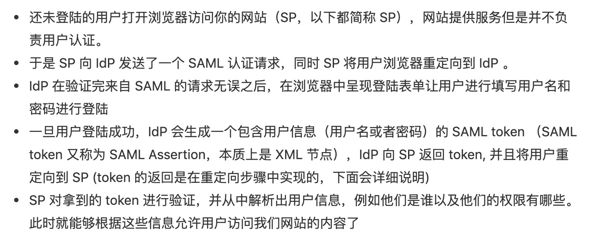

# 前后端鉴权二三事

## 认证与授权
### 认证（Authentication）
认证用于描述用户的身份。可以简单理解为登录，以此确认你是一个合法的用户。比如说掘金必须要登录才能点赞、收藏。而你一旦登录了，那么相应的就有了在掘金上特定的权限，比如说你可以编辑和删除自己的文章，但是不能操作别人的，除非你登录用的账号是超级管理员。从这个意义上看，你在登录的瞬间，你在所登录网站上的权限就已经确定了。
### 授权（Authorisation）
授权用于描述第三方应用有哪些操作权限，比如说你在外卖小程序中叫外卖，可以一键点击允许当前小程序获得你微信绑定的手机号，此时相当于你把你存放在微信的手机号数据授权给外卖小程序使用。
### 带入场景区分认证与授权
我们分别举三个例子来说明三种情况让大家对认证和授权的关系有更好的理解：只认证不授权、即认证又授权、不认证只授权。
#### （1）只认证不授权
上面提到的使用掘金账号登录掘金就是只认证不授权的场景，此时掘金只知道你是哪个用户，但是不涉及到授权的操作。
#### （2）即认证又授权
同样是登录掘金，我们可以不使用在掘金注册的账号和密码登录，而选择第三方应用登录，比如说github。此时会弹出github 的登录页面，并提示你掘金可能获取你在github 的哪些信息，比如说用户名和头像。在这个过程中即完成了认证（合法用户）又完成了授权（你允许掘金从github 获取你的信息）。
#### （3）不认证只授权
回到上面我们讲到的外卖小程序的例子，在你第一次进入外卖小程序的时候小程序会弹框请求获取你的个人信息，此时相当于上面提到的即认证又授权。你同意以后就相当于使用微信账号登录，但是此时外卖小程序获取到的你的信息不包括你的手机号。当你要下单点击提交的时候，小程序再次发起请求，要获取你微信绑定的手机号，此时发生的动作就是不认证只授权。

## 有哪些认证和授权方式？
一旦涉及认证，必须要考虑的一个问题就是状态管理。所谓的状态管理就是说我们在一个网站进行登录之后的一段时间里，不希望每次访问它都需要重新登录，所以应用开发者必须要考虑怎么样保持用户的登录状态以及决定何时失效。而这个过程需要前后端通力合作来完成。
### Session-Cookie 认证
- 用户先使用用户名和密码登录，登录完成后后端将用户信息存在session 中，把sessionId 写到前端的cookie 中，后面每次操作带着cookie 去后端，只要后端判断sessionId 没问题且没过期就不需要再次登录
- cookie安全性问题、跨域问题，session耗费服务器资源、分布式session共享问题
### Token 认证（JWT 和SAML）
与上面的Session-Cookie 机制不同的地方在于，基于token 的用户认证是一种服务端无状态的认证方式，服务端不用存放token 数据，但是服务器需求想办法验证token 的合法性和有效性。
#### JWT
前端拿到的内容：算出签名以后，把 Header、Payload、Signature 三个部分拼成一个字符串，每个部分之间用"点"（.）分隔，就可以返回给用户。
优势：可以放在header 的Authorization 中，不需要cookie，所以可以作为跨域认证授权的解决方案
缺点：一旦 JWT 签发了，到期之前就会始终有效，除非服务器部署额外的逻辑。JWT 一旦泄露，任何人都可以获得该令牌的所有权限。
问题：
（1）JWT 用于签名和验证签名的secret 对于所有人来说都是一样的吗？如果一样的则存在比较大的安全隐患，一旦泄露，所有JWT 都可能会被破解。如果不一样，那么同样需要在服务器端维护每一个人对应的secret 信息，这样的话和服务器端维护session 信息又有什么区别呢？
（2）同一个人不同时间登录的secret 是一样的吗？
#### SAML

### OAuth 授权

#### SAML 2.0
诞生于2005年，不适用于跨平台场景，比如从手机应用跳到浏览器进行认证
#### OAuth 2.0
> OAuth 的本意是一个应用允许另一个应用在用户授权的情况下访问自己的数据，OAuth 的设计本意更倾向于授权而非认证（当然授权用户信息就间接实现了认证）
为什么要用code 换token，因为code 会直接显示在浏览器的url 上，不安全，别人看到code 没用，因为code 有时效性。
## SSO
### Why we need SSO?
DevCloud 下有那么多微服务，比如项目管理、代码托管、代码检查、流水线、编译构建等，大家需要认证的时候都去一个地方，然后认证完了之后状态可以共享。
### Session + Token 实现SSO
在日常开发过程中，我们为什么会同时接触到session 和token？按理来说，session 和token 是用于认证授权的两种方式？

#### CAS

CAS （Central Authentication Service）中央认证服务，是一款不错的Web 应用的单点登录框架，包含CAS Server、CAS Client 和Web Browser 三个概念。CAS的核心就是Ticket，中文称之为票据。

#### TGC

1、是什么

Ticket-granting cookie(TGC) ：存放用户身份认证凭证的 cookie ，在浏览器和 CAS Server 间通讯时使用，并且只能基于安全通道传输（ Https ），是 CAS Server 用来明确用户身份的凭证；

2、为什么需要？

同一公司中的AB两个子服务都依赖C做单点登录，用户在A登录以后，如果跳转到B进行访问，不需要再次登录，这个过程就是由TGC保障的，用户浏览器带着TGC到C（C根据这个TGC找到一个TGT，存放的是用户的信息），C判断这是一个已登录用户，告诉B可以直接访问资源。

3、TGC过期规则是如何设置的？

可以在cas.properties中进行配置，默认八小时，无操作，默认两小时。

#### ST

ST票据过期配置，默认时间是10秒钟。所以需要用ST换取token？然后用session 管理token，可以维持一个小时不过期

Ref：

https://blog.csdn.net/yushenzaishi/article/details/80435343

## Ref
- 不要用JWT替代session管理（上）：全面了解Token,JWT,OAuth,SAML,SSO：https://juejin.im/post/5b3b870a5188251ac85826b8
- 傻傻分不清之 Cookie、Session、Token、JWT：https://juejin.im/post/5e055d9ef265da33997a42cc#heading-22
- JSON Web Token 入门教程：http://www.ruanyifeng.com/blog/2018/07/json_web_token-tutorial.html （阅读时间：2mins）