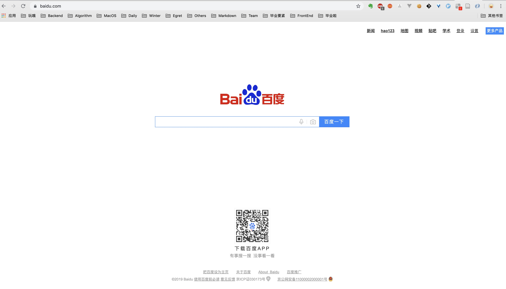

#### 从黏知了的角度来看前端

小时候的夏天，喜欢出去黏知了。手里拿根针，针上穿一根长长的线，然后在线尾打个结。黏到知了以后，用针从知了的腹部刺过，知了就挂在了线上。辛苦劳作一下午，线上就穿满了知了，此起彼伏的知了叫声让我觉得特别有成就感。

在这里，我想用类似穿知了的方法以一个例子（百度首页）穿起前端的概念和知识点，中间也会夹杂着各种技术的演技和变迁。今晚，咱们只谈理论，不聊实践。

##### 页面展示

百度的首页是一个简单的页面，主要分为三部分，头部的多个链接，中间的搜索框，和下边的二维码广告等。

构成这个页面有两个必不可少的要素：元素和样式。元素决定了展示什么（文字、段落、图片、链接、按钮、文本框等），样式决定如何展示（宽高、位置、颜色、背景色、圆角、旋转、动画等）。所有的静态页面都是由这两个要素组成，要想能顺利地完成页面绘制工作，必须要了解到HTML和CSS相关的知识点如下（所有标有教程两个字的内容快速过，以了解语法为主，现用现查）：
- HTML教程：https://www.runoob.com/html/html-tutorial.html
- HTML5语义化标签：http://www.daqianduan.com/6549.html
- CSS教程：https://www.runoob.com/css/css-tutorial.html
- CSS盒子模型：https://blog.csdn.net/qq_34966814/article/details/82872971
- CSS position属性：https://www.cnblogs.com/guolao/p/9048308.html

##### 前端与后端
现在，尝试在百度中间的文本框中输入任何内容，发现页面的展示发生了变化。

##### 数据获取--Ajax

##### 浏览器调试

##### 前端框架

##### Node

##### 编译构建--Webpack

##### 开发工具

##### JQuery

##### EcmaScript 56789

[https://github.com/ruanyf/jstraining/blob/master/docs/history.md#%E6%9C%AA%E6%9D%A5%E5%8F%AA%E6%9C%89%E4%B8%A4%E7%A7%8D%E8%BD%AF%E4%BB%B6%E5%B7%A5%E7%A8%8B%E5%B8%88](https://github.com/ruanyf/jstraining/blob/master/docs/history.md#未来只有两种软件工程师)

https://github.com/qianguyihao/Web

https://www.kancloud.cn/xiak/quanduan/265898
